# ⚡ NOVUS: Autonomous Customer Resolution Engine


> **Redefining Enterprise Support with Self-Correcting, Multi-Agent Intelligence.**

---

## 🧠 The Concept
**NOVUS** is not a chatbot. It is a **deterministic, multi-agent orchestration system** designed to solve complex customer support workflows autonomously. 

Unlike traditional LLM wrappers that simply generate text, NOVUS employs a **"Swarm Architecture"** where specialized agents collaborate, critique, and refine their outputs before ever interacting with a customer. It mimics the workflow of a human support team—complete with a Triage Specialist, a Senior Strategist, and a Quality Assurance Supervisor.

---

## 🌟 Key Differentiators

### 🛡️ The "Critic Loop" (Self-Correction)
Most AI agents "hallucinate" or drift in tone. NOVUS features a dedicated **Critic Agent** that acts as a guardrail. 
* It reviews every draft response against the calculated **Risk Score**.
* If a response is too casual for a high-severity issue, the Critic **rejects** the draft and forces the Drafter Agent to rewrite it.
* *Result:* Zero "tone-deaf" responses, ensuring 100% brand safety.

### 🧠 Semantic Memory (RAG)
NOVUS doesn't start from scratch. It utilizes **Vector Embeddings** to recall how similar tickets were resolved in the past.
* *Recurring Issue Detection:* "Oh, this looks like the server outage from last Tuesday."
* *Consistency:* Ensures different customers get the same solution for the same problem.

### ⚖️ Dynamic Risk Scoring
We move beyond simple "High/Low" tags. NOVUS calculates a weighted **Risk Index (0-100)** based on:
1.  **Sentiment Magnitude** (Hostility vs. Frustration)
2.  **Urgency Keywords** (e.g., "Lawsuit", "Fire", "Data Breach")
3.  **Customer History** (LTV and past churn threats)

---

## 🏗️ System Architecture

The system follows a **Hub-and-Spoke Coordinator Pattern**, implementing the principles of the **Google Agent Development Kit (ADK)**.

```mermaid
graph TD
    User[User Complaint] -->|Ingestion| Coord{Coordinator Agent}
    Coord -->|1. Analysis| Class[Classification Agent]
    Coord -->|1. Analysis| Sent[Sentiment Agent]
    Coord -->|2. Context| Mem[(Vector Memory)]
    Coord -->|3. Ranking| Prio[Prioritization Agent]
    Coord -->|4. Strategy| Dec[Decision Agent]
    Coord -->|5. Draft| Draft[Response Agent]
    Draft -->|Draft Text| Critic[🕵️ Critic Agent]
    Critic -->|Reject| Draft
    Critic -->|Approve| Coord
    Coord -->|Final Output| User

```



---

## 🤖 The Agent Swarm

Each agent in NOVUS has a single responsibility (SRP), ensuring modularity and easier debugging.

| Agent | Model | Role |
| --- | --- | --- |
| **Coordinator** | *Orchestrator* | The "Central Nervous System." Routes data, manages state, and handles error recovery. |
| **Classification** | `Gemini 2.5 Flash` | Identifies Intent (e.g., "Refund") and Business Category (e.g., "Billing"). |
| **Sentiment** | `Gemini 2.5 Flash` | Analyzes emotional tone (-1.0 to +1.0) and detects sarcasm. |
| **Prioritization** | `Gemini 2.5 Flash` | Computes the `Risk Score`. Decides *when* to wake up the Critic. |
| **Decision** | `Gemini 2.5 Flash` | Determines the *Next Best Action* (Reply, Escalate, Refund, Investigate). |
| **Drafter** | `Gemini 2.5 Flash` | Generates the actual text response based on the Decision strategy. |
| **Critic** | `Gemini 2.5 Flash` | **The Gatekeeper.** Reviews drafts for empathy, policy compliance, and safety. |

---

## 🛠️ Technical Stack

* **Core Logic:** Python 3.10+
* **Intelligence:** Google Gemini 2.5 Flash (via `google-generativeai` SDK)
* **Memory Store:** Local Vector Store (JSON + NumPy) using `text-embedding-004`
* **Data Validation:** Pydantic (Strict typing for robust JSON parsing)
* **Environment Management:** `python-dotenv`
* **Interface:** CLI (Simulated Chat Stream)

---

## 🚀 Getting Started

### Prerequisites

* Python 3.10 or higher
* A Google Cloud Project with Vertex AI or Gemini API access
* An API Key

### Installation

1. **Clone the Repository**
```bash
git clone [https://github.com/dharm3112/techsprint-hackathon.git](https://github.com/dharm3112/techsprint-hackathon.git)
cd techsprint-hackathon

```


2. **Install Dependencies**
```bash
pip install -r requirements.txt

```


3. **Configure Environment**
Create a `.env` file in the root directory:
```ini
GEMINI_API_KEY="your_google_api_key_here"

```


### Running the Agent

NOVUS comes with a built-in demo suite.

```bash
python main.py

```

*Select Mode:*

* **Option 1 (Batch Demo):** Runs a pre-set list of test cases (Billing error, Fire hazard, Tech support) to showcase the agent's range.
* **Option 2 (Interactive):** Chat with NOVUS live in the terminal.

---

## 🔮 Future Roadmap

* [ ] **Voice Interface:** Integration with Gemini Multimodal capabilities to handle audio complaints.
* [ ] **Dashboard UI:** A React/Streamlit frontend for real-time visualization of the "Thought Process."
* [ ] **CRM Webhooks:** Direct integration with Salesforce/Zendesk to fetch real Customer LTV data.
* [ ] **Containerization:** Docker support for easy cloud deployment.

---

## 🤝 Contributing

Contributions are what make the open-source community such an amazing place to learn, inspire, and create. Any contributions you make are **greatly appreciated**.

1. Fork the Project
2. Create your Feature Branch (`git checkout -b feature/AmazingFeature`)
3. Commit your Changes (`git commit -m 'Add some AmazingFeature'`)
4. Push to the Branch (`git push origin feature/AmazingFeature`)
5. Open a Pull Request

---

## 📄 License

Distributed under the MIT License. See `LICENSE` for more information.

---

<p align="center">
Built with ❤️ for the TechSprint Hackathon
</p>

<!--,## 🔮 Future Enhancements
-   **Voice Interface**: Integrate Gemini Multimodal capabilities for audio complaints.
-   **CRM Integration**: Connect to Salesforce/Zendesk APIs.
-   **Real-time Dashboard**: Streamlit UI for monitoring agent decisions.
-->
